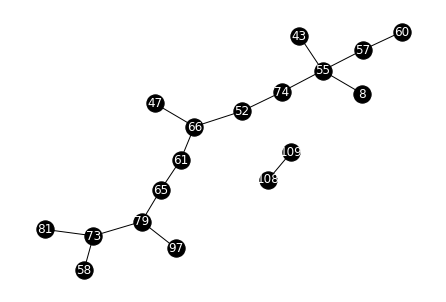

# PyEnGNet 1.0

# Introducción
Las principales aplicaciones de esta nueva herramienta desarrollada en la Universidad Pablo de Olavide se centran en el campo de la Bioinformática y la Biomedicina. Así, por ejemplo con EnGNet 1.0 es posible llevar a cabo análisis biomédicos de diferentes procesos biológicos tales como análisis de biomarcadores, interacciones gen-gene entre otros. Actualmente la utilidad del software ha sido testada en el análisis del síndrome de estrés postraumático.

Y es que las redes genéticas se han convertido en una herramienta poderosa en el análisis integral de la expresión génica. Debido a la creciente cantidad de datos genéticos disponibles, los métodos computacionales para la generación de redes deben hacer frente a la llamada maldición de la dimensionalidad en la búsqueda de la fiabilidad de los resultados obtenidos. En este contexto, las técnicas de ensemble learning han mejorado significativamente la precisión de los resultados al combinar diferentes medidas, algoritmos o métodos.  Por otro lado, las técnicas de optimización topológicas también son importantes en la reducción del tamaño de las redes, no sólo mejorando su arquitectura de red sino también manteniendo significancia biológica.

EnGNet 1.0 es una aplicación informática que implementa una nueva metodología de explotación de datos de expresión genética denominada EnGNet.  EnGNet es un nuevo algoritmo de dos pasos para la generación de redes de genes. 

En primer lugar, el programa emplea una técnica de ensemble (“comité de máquinas”)  para la generación de redes de co-expresión genética.

En segundo lugar, un algoritmo voraz optimiza tanto el tamaño como las características topológicas de la red. Este método no sólo es capaz de obtener redes fiables, sino que también mejora significativamente las características topológicas.

La herramienta EnGNet fue desarrollada originalmente en el lenguaje de programación Java, ahora queremos dar el paso a 
migrar la tecnología al popular lenguaje de programación python


```python
import pandas as pd
import scipy.stats as scp
import numpy as np
from tqdm import tqdm
from sklearn.metrics.cluster import normalized_mutual_info_score
import networkx as nx
```

# Paso 1. Preparación de los datos para el algoritmo

Debemos definir la matriz de datos genéticos que se va a utilizar así como los umbrales que deben superar las medidas de correlación utilizadas por el algoritmo.

Suponiendo que partimos de este dataset


```python
df = pd.read_csv("Data/113_exp_mat_cond_1.csv")
df = pd.DataFrame(df)
df
```


<div>
<style scoped>
    .dataframe tbody tr th:only-of-type {
        vertical-align: middle;
    }

    .dataframe tbody tr th {
        vertical-align: top;
    }

    .dataframe thead th {
        text-align: right;
    }
</style>
<table border="1" class="dataframe">
  <thead>
    <tr style="text-align: right;">
      <th></th>
      <th>Unnamed: 0</th>
      <th>sample_3</th>
      <th>sample_4</th>
      <th>sample_5</th>
      <th>sample_6</th>
      <th>sample_9</th>
      <th>sample_10</th>
      <th>sample_11</th>
      <th>sample_14</th>
      <th>sample_15</th>
      <th>...</th>
      <th>sample_478</th>
      <th>sample_482</th>
      <th>sample_483</th>
      <th>sample_485</th>
      <th>sample_488</th>
      <th>sample_493</th>
      <th>sample_496</th>
      <th>sample_497</th>
      <th>sample_499</th>
      <th>sample_500</th>
    </tr>
  </thead>
  <tbody>
    <tr>
      <th>0</th>
      <td>ADR1</td>
      <td>0.393726</td>
      <td>0.139099</td>
      <td>0.052912</td>
      <td>0.079489</td>
      <td>0.110079</td>
      <td>0.076913</td>
      <td>0.170031</td>
      <td>0.076548</td>
      <td>0.378425</td>
      <td>...</td>
      <td>0.135870</td>
      <td>0.555923</td>
      <td>0.053774</td>
      <td>0.063177</td>
      <td>0.120053</td>
      <td>0.511716</td>
      <td>0.171683</td>
      <td>0.181483</td>
      <td>0.186592</td>
      <td>0.166621</td>
    </tr>
    <tr>
      <th>1</th>
      <td>FLO8</td>
      <td>0.368257</td>
      <td>0.226366</td>
      <td>0.192921</td>
      <td>0.304331</td>
      <td>0.347783</td>
      <td>0.460730</td>
      <td>0.247321</td>
      <td>0.488002</td>
      <td>0.395741</td>
      <td>...</td>
      <td>0.368265</td>
      <td>0.436692</td>
      <td>0.331386</td>
      <td>0.396856</td>
      <td>0.187229</td>
      <td>0.297722</td>
      <td>0.384049</td>
      <td>0.422091</td>
      <td>0.349731</td>
      <td>0.260438</td>
    </tr>
    <tr>
      <th>2</th>
      <td>GIS1</td>
      <td>0.500661</td>
      <td>0.267286</td>
      <td>0.480420</td>
      <td>0.449263</td>
      <td>0.462302</td>
      <td>0.332204</td>
      <td>0.347251</td>
      <td>0.346586</td>
      <td>0.356450</td>
      <td>...</td>
      <td>0.452821</td>
      <td>0.340253</td>
      <td>0.482209</td>
      <td>0.524972</td>
      <td>0.486942</td>
      <td>0.474888</td>
      <td>0.435856</td>
      <td>0.357013</td>
      <td>0.610022</td>
      <td>0.443499</td>
    </tr>
    <tr>
      <th>3</th>
      <td>IME4</td>
      <td>0.418802</td>
      <td>0.382483</td>
      <td>0.333717</td>
      <td>0.295416</td>
      <td>0.313251</td>
      <td>0.385264</td>
      <td>0.350356</td>
      <td>0.435079</td>
      <td>0.418417</td>
      <td>...</td>
      <td>0.350447</td>
      <td>0.329192</td>
      <td>0.426531</td>
      <td>0.389524</td>
      <td>0.412562</td>
      <td>0.483822</td>
      <td>0.332376</td>
      <td>0.317330</td>
      <td>0.387120</td>
      <td>0.373825</td>
    </tr>
    <tr>
      <th>4</th>
      <td>KAR4</td>
      <td>0.528209</td>
      <td>0.494533</td>
      <td>0.466775</td>
      <td>0.390307</td>
      <td>0.547182</td>
      <td>0.436885</td>
      <td>0.585211</td>
      <td>0.542756</td>
      <td>0.565251</td>
      <td>...</td>
      <td>0.413356</td>
      <td>0.582158</td>
      <td>0.484834</td>
      <td>0.523137</td>
      <td>0.522180</td>
      <td>0.286004</td>
      <td>0.642618</td>
      <td>0.526924</td>
      <td>0.584369</td>
      <td>0.533382</td>
    </tr>
    <tr>
      <th>...</th>
      <td>...</td>
      <td>...</td>
      <td>...</td>
      <td>...</td>
      <td>...</td>
      <td>...</td>
      <td>...</td>
      <td>...</td>
      <td>...</td>
      <td>...</td>
      <td>...</td>
      <td>...</td>
      <td>...</td>
      <td>...</td>
      <td>...</td>
      <td>...</td>
      <td>...</td>
      <td>...</td>
      <td>...</td>
      <td>...</td>
      <td>...</td>
    </tr>
    <tr>
      <th>108</th>
      <td>ENT1</td>
      <td>0.518182</td>
      <td>0.575945</td>
      <td>0.514139</td>
      <td>0.538879</td>
      <td>0.463914</td>
      <td>0.420827</td>
      <td>0.638548</td>
      <td>0.450177</td>
      <td>0.619931</td>
      <td>...</td>
      <td>0.545532</td>
      <td>0.538625</td>
      <td>0.435721</td>
      <td>0.473603</td>
      <td>0.701581</td>
      <td>0.552184</td>
      <td>0.544960</td>
      <td>0.544448</td>
      <td>0.543322</td>
      <td>0.565474</td>
    </tr>
    <tr>
      <th>109</th>
      <td>KTR1</td>
      <td>0.679404</td>
      <td>0.622695</td>
      <td>0.619771</td>
      <td>0.718633</td>
      <td>0.454273</td>
      <td>0.554298</td>
      <td>0.823445</td>
      <td>0.462051</td>
      <td>0.778620</td>
      <td>...</td>
      <td>0.637161</td>
      <td>0.611109</td>
      <td>0.622095</td>
      <td>0.464864</td>
      <td>0.763002</td>
      <td>0.690760</td>
      <td>0.697808</td>
      <td>0.589683</td>
      <td>0.568464</td>
      <td>0.537067</td>
    </tr>
    <tr>
      <th>110</th>
      <td>KTR2</td>
      <td>0.716606</td>
      <td>0.762449</td>
      <td>0.675982</td>
      <td>0.752573</td>
      <td>0.653249</td>
      <td>0.656137</td>
      <td>0.803875</td>
      <td>0.610495</td>
      <td>0.758321</td>
      <td>...</td>
      <td>0.782004</td>
      <td>0.693562</td>
      <td>0.580309</td>
      <td>0.642324</td>
      <td>0.659733</td>
      <td>0.711134</td>
      <td>0.755975</td>
      <td>0.877445</td>
      <td>0.751245</td>
      <td>0.662435</td>
    </tr>
    <tr>
      <th>111</th>
      <td>SUT1</td>
      <td>0.659796</td>
      <td>0.546139</td>
      <td>0.594530</td>
      <td>0.635661</td>
      <td>0.498229</td>
      <td>0.605627</td>
      <td>0.757235</td>
      <td>0.567830</td>
      <td>0.641744</td>
      <td>...</td>
      <td>0.606450</td>
      <td>0.596641</td>
      <td>0.561738</td>
      <td>0.496406</td>
      <td>0.738552</td>
      <td>0.610183</td>
      <td>0.640114</td>
      <td>0.689054</td>
      <td>0.546962</td>
      <td>0.618393</td>
    </tr>
    <tr>
      <th>112</th>
      <td>YOR225W</td>
      <td>0.698325</td>
      <td>0.682191</td>
      <td>0.698340</td>
      <td>0.705864</td>
      <td>0.565678</td>
      <td>0.544833</td>
      <td>0.826599</td>
      <td>0.676943</td>
      <td>0.731156</td>
      <td>...</td>
      <td>0.758175</td>
      <td>0.723023</td>
      <td>0.529402</td>
      <td>0.643550</td>
      <td>0.803131</td>
      <td>0.599709</td>
      <td>0.618113</td>
      <td>0.676671</td>
      <td>0.633684</td>
      <td>0.788169</td>
    </tr>
  </tbody>
</table>
<p>113 rows × 182 columns</p>
</div>


manipulamos el dataset para obtener únicamente la matriz de datos


```python
df = df.drop(df.columns[[0,2]], axis=1)
data = df.to_numpy()
pd.DataFrame(data)
```


<div>
<style scoped>
    .dataframe tbody tr th:only-of-type {
        vertical-align: middle;
    }

    .dataframe tbody tr th {
        vertical-align: top;
    }

    .dataframe thead th {
        text-align: right;
    }
</style>
<table border="1" class="dataframe">
  <thead>
    <tr style="text-align: right;">
      <th></th>
      <th>0</th>
      <th>1</th>
      <th>2</th>
      <th>3</th>
      <th>4</th>
      <th>5</th>
      <th>6</th>
      <th>7</th>
      <th>8</th>
      <th>9</th>
      <th>...</th>
      <th>170</th>
      <th>171</th>
      <th>172</th>
      <th>173</th>
      <th>174</th>
      <th>175</th>
      <th>176</th>
      <th>177</th>
      <th>178</th>
      <th>179</th>
    </tr>
  </thead>
  <tbody>
    <tr>
      <th>0</th>
      <td>0.393726</td>
      <td>0.052912</td>
      <td>0.079489</td>
      <td>0.110079</td>
      <td>0.076913</td>
      <td>0.170031</td>
      <td>0.076548</td>
      <td>0.378425</td>
      <td>0.069374</td>
      <td>-0.024883</td>
      <td>...</td>
      <td>0.135870</td>
      <td>0.555923</td>
      <td>0.053774</td>
      <td>0.063177</td>
      <td>0.120053</td>
      <td>0.511716</td>
      <td>0.171683</td>
      <td>0.181483</td>
      <td>0.186592</td>
      <td>0.166621</td>
    </tr>
    <tr>
      <th>1</th>
      <td>0.368257</td>
      <td>0.192921</td>
      <td>0.304331</td>
      <td>0.347783</td>
      <td>0.460730</td>
      <td>0.247321</td>
      <td>0.488002</td>
      <td>0.395741</td>
      <td>0.336612</td>
      <td>0.395995</td>
      <td>...</td>
      <td>0.368265</td>
      <td>0.436692</td>
      <td>0.331386</td>
      <td>0.396856</td>
      <td>0.187229</td>
      <td>0.297722</td>
      <td>0.384049</td>
      <td>0.422091</td>
      <td>0.349731</td>
      <td>0.260438</td>
    </tr>
    <tr>
      <th>2</th>
      <td>0.500661</td>
      <td>0.480420</td>
      <td>0.449263</td>
      <td>0.462302</td>
      <td>0.332204</td>
      <td>0.347251</td>
      <td>0.346586</td>
      <td>0.356450</td>
      <td>0.509264</td>
      <td>0.486996</td>
      <td>...</td>
      <td>0.452821</td>
      <td>0.340253</td>
      <td>0.482209</td>
      <td>0.524972</td>
      <td>0.486942</td>
      <td>0.474888</td>
      <td>0.435856</td>
      <td>0.357013</td>
      <td>0.610022</td>
      <td>0.443499</td>
    </tr>
    <tr>
      <th>3</th>
      <td>0.418802</td>
      <td>0.333717</td>
      <td>0.295416</td>
      <td>0.313251</td>
      <td>0.385264</td>
      <td>0.350356</td>
      <td>0.435079</td>
      <td>0.418417</td>
      <td>0.390439</td>
      <td>0.357992</td>
      <td>...</td>
      <td>0.350447</td>
      <td>0.329192</td>
      <td>0.426531</td>
      <td>0.389524</td>
      <td>0.412562</td>
      <td>0.483822</td>
      <td>0.332376</td>
      <td>0.317330</td>
      <td>0.387120</td>
      <td>0.373825</td>
    </tr>
    <tr>
      <th>4</th>
      <td>0.528209</td>
      <td>0.466775</td>
      <td>0.390307</td>
      <td>0.547182</td>
      <td>0.436885</td>
      <td>0.585211</td>
      <td>0.542756</td>
      <td>0.565251</td>
      <td>0.436395</td>
      <td>0.460720</td>
      <td>...</td>
      <td>0.413356</td>
      <td>0.582158</td>
      <td>0.484834</td>
      <td>0.523137</td>
      <td>0.522180</td>
      <td>0.286004</td>
      <td>0.642618</td>
      <td>0.526924</td>
      <td>0.584369</td>
      <td>0.533382</td>
    </tr>
    <tr>
      <th>...</th>
      <td>...</td>
      <td>...</td>
      <td>...</td>
      <td>...</td>
      <td>...</td>
      <td>...</td>
      <td>...</td>
      <td>...</td>
      <td>...</td>
      <td>...</td>
      <td>...</td>
      <td>...</td>
      <td>...</td>
      <td>...</td>
      <td>...</td>
      <td>...</td>
      <td>...</td>
      <td>...</td>
      <td>...</td>
      <td>...</td>
      <td>...</td>
    </tr>
    <tr>
      <th>108</th>
      <td>0.518182</td>
      <td>0.514139</td>
      <td>0.538879</td>
      <td>0.463914</td>
      <td>0.420827</td>
      <td>0.638548</td>
      <td>0.450177</td>
      <td>0.619931</td>
      <td>0.414552</td>
      <td>0.530368</td>
      <td>...</td>
      <td>0.545532</td>
      <td>0.538625</td>
      <td>0.435721</td>
      <td>0.473603</td>
      <td>0.701581</td>
      <td>0.552184</td>
      <td>0.544960</td>
      <td>0.544448</td>
      <td>0.543322</td>
      <td>0.565474</td>
    </tr>
    <tr>
      <th>109</th>
      <td>0.679404</td>
      <td>0.619771</td>
      <td>0.718633</td>
      <td>0.454273</td>
      <td>0.554298</td>
      <td>0.823445</td>
      <td>0.462051</td>
      <td>0.778620</td>
      <td>0.607679</td>
      <td>0.716958</td>
      <td>...</td>
      <td>0.637161</td>
      <td>0.611109</td>
      <td>0.622095</td>
      <td>0.464864</td>
      <td>0.763002</td>
      <td>0.690760</td>
      <td>0.697808</td>
      <td>0.589683</td>
      <td>0.568464</td>
      <td>0.537067</td>
    </tr>
    <tr>
      <th>110</th>
      <td>0.716606</td>
      <td>0.675982</td>
      <td>0.752573</td>
      <td>0.653249</td>
      <td>0.656137</td>
      <td>0.803875</td>
      <td>0.610495</td>
      <td>0.758321</td>
      <td>0.646875</td>
      <td>0.592495</td>
      <td>...</td>
      <td>0.782004</td>
      <td>0.693562</td>
      <td>0.580309</td>
      <td>0.642324</td>
      <td>0.659733</td>
      <td>0.711134</td>
      <td>0.755975</td>
      <td>0.877445</td>
      <td>0.751245</td>
      <td>0.662435</td>
    </tr>
    <tr>
      <th>111</th>
      <td>0.659796</td>
      <td>0.594530</td>
      <td>0.635661</td>
      <td>0.498229</td>
      <td>0.605627</td>
      <td>0.757235</td>
      <td>0.567830</td>
      <td>0.641744</td>
      <td>0.538927</td>
      <td>0.681520</td>
      <td>...</td>
      <td>0.606450</td>
      <td>0.596641</td>
      <td>0.561738</td>
      <td>0.496406</td>
      <td>0.738552</td>
      <td>0.610183</td>
      <td>0.640114</td>
      <td>0.689054</td>
      <td>0.546962</td>
      <td>0.618393</td>
    </tr>
    <tr>
      <th>112</th>
      <td>0.698325</td>
      <td>0.698340</td>
      <td>0.705864</td>
      <td>0.565678</td>
      <td>0.544833</td>
      <td>0.826599</td>
      <td>0.676943</td>
      <td>0.731156</td>
      <td>0.675671</td>
      <td>0.691082</td>
      <td>...</td>
      <td>0.758175</td>
      <td>0.723023</td>
      <td>0.529402</td>
      <td>0.643550</td>
      <td>0.803131</td>
      <td>0.599709</td>
      <td>0.618113</td>
      <td>0.676671</td>
      <td>0.633684</td>
      <td>0.788169</td>
    </tr>
  </tbody>
</table>
<p>113 rows × 180 columns</p>
</div>


Y definimos las variables del algoritmo


```python
row_size = len(data)
column_size = len(data[0])

spearman_threshold = 0.7
kendall_threshold  = 0.7
nmi_threshold = 0.6
pearson_threshold = 0.7
```

# Paso 2. Definición de las funciones utilizadas por el algoritmo

Funciones de tests de correlación unitarios


```python
def single_nmi(arr1, arr2, precission=1):
    ans = 0
    rnd = lambda x: round(x, precission)
    v1 = np.array(list(map(rnd, arr1)))
    v2 = np.array(list(map(rnd, arr2)))
    corr = normalized_mutual_info_score(v1, v2)
    if corr >= nmi_threshold:
        ans = 1
    return ans, corr
    

def single_spearman(arr1, arr2):
    ans = 0
    corr, pv = scp.spearmanr(arr1, arr2)
    corr = abs(corr)
    if corr >= spearman_threshold:
        ans = 1
    return ans, corr


def single_pearson(arr1, arr2):
    ans = 0
    corr, pv = scp.pearsonr(arr1, arr2)
    corr = abs(corr)
    if corr >= pearson_threshold:
        ans = 1
    return ans, corr


def single_kendall(arr1, arr2):
    ans = 0
    corr, pv = scp.kendalltau(arr1, arr2)
    corr = abs(corr)
    if corr >= kendall_threshold:
        ans = 1
    return ans, corr
```

Función para validar la correlación entre dos vectores de expresión genética


```python
def validate_corr(i, j, accepted_values, data):
    major_voting = 0

    # Las dos filas que vamos a utilizar
    v = data[i]
    w = data[j]

    # Agregamos las respuestas de los tests a una lista que servirá para el calculo de los pesos
    tests = [single_pearson(v, w), single_kendall(v, w), single_spearman(v, w)]

    for test in tests:
        major_voting += test[0]

    if major_voting >= len(tests)/2:
        accepted_values.append((i, j, {'weight': calculate_weight(tests)}))
```

Función para calcular el peso de una correlación exitosa en la validación


```python
def calculate_weight(tests):
    weight = []

    for test in tests:
        if bool(test[0]):
            weight.append(test[1])
            
    return np.mean(weight)
```

Funcionamiento del bucle de EnGNet


```python
def engnet_1_0(row_size, data):
    engnet_accepted_values = []

    for i in tqdm(range(row_size)):
        for j in range(i + 1, row_size):
            validate_corr(i, j, engnet_accepted_values, data)
            
    return engnet_accepted_values
```

# Paso 3. Ejecutar, obtener el grafo principal y obtener el arbol de recorrido máximo

Con lo anterior definido obtenemos las aristas de proporcionadas por EnGNet


```python
edges = engnet_1_0(row_size, data)
G = nx.Graph()
G.add_edges_from(edges)
```

    100%|█████████████████████████████████████████████████████████████████████████| 113/113 [00:04<00:00, 26.32it/s]


```python
options = {
    'node_color': 'black',
    'font_color': 'white',
    'with_labels': True
}

newhead = ["GenA", "GenB", "Weight"]
pd.DataFrame(edges, columns=newhead)

```


<div>
<style scoped>
    .dataframe tbody tr th:only-of-type {
        vertical-align: middle;
    }

    .dataframe tbody tr th {
        vertical-align: top;
    }

    .dataframe thead th {
        text-align: right;
    }
</style>
<table border="1" class="dataframe">
  <thead>
    <tr style="text-align: right;">
      <th></th>
      <th>GenA</th>
      <th>GenB</th>
      <th>Weight</th>
    </tr>
  </thead>
  <tbody>
    <tr>
      <th>0</th>
      <td>8</td>
      <td>55</td>
      <td>{'weight': 0.7089923579941719}</td>
    </tr>
    <tr>
      <th>1</th>
      <td>43</td>
      <td>52</td>
      <td>{'weight': 0.7155115996731671}</td>
    </tr>
    <tr>
      <th>2</th>
      <td>43</td>
      <td>55</td>
      <td>{'weight': 0.7462321210562424}</td>
    </tr>
    <tr>
      <th>3</th>
      <td>47</td>
      <td>61</td>
      <td>{'weight': 0.7041228657045737}</td>
    </tr>
    <tr>
      <th>4</th>
      <td>47</td>
      <td>66</td>
      <td>{'weight': 0.7199583800134501}</td>
    </tr>
    <tr>
      <th>5</th>
      <td>52</td>
      <td>66</td>
      <td>{'weight': 0.7473299128183515}</td>
    </tr>
    <tr>
      <th>6</th>
      <td>52</td>
      <td>74</td>
      <td>{'weight': 0.7180753552255581}</td>
    </tr>
    <tr>
      <th>7</th>
      <td>55</td>
      <td>57</td>
      <td>{'weight': 0.7228738030320297}</td>
    </tr>
    <tr>
      <th>8</th>
      <td>55</td>
      <td>74</td>
      <td>{'weight': 0.7277715940754805}</td>
    </tr>
    <tr>
      <th>9</th>
      <td>57</td>
      <td>60</td>
      <td>{'weight': 0.7175741808144404}</td>
    </tr>
    <tr>
      <th>10</th>
      <td>58</td>
      <td>61</td>
      <td>{'weight': 0.7014477061458867}</td>
    </tr>
    <tr>
      <th>11</th>
      <td>58</td>
      <td>73</td>
      <td>{'weight': 0.7163674643506253}</td>
    </tr>
    <tr>
      <th>12</th>
      <td>61</td>
      <td>65</td>
      <td>{'weight': 0.7111088554638296}</td>
    </tr>
    <tr>
      <th>13</th>
      <td>61</td>
      <td>66</td>
      <td>{'weight': 0.7131274260858367}</td>
    </tr>
    <tr>
      <th>14</th>
      <td>65</td>
      <td>79</td>
      <td>{'weight': 0.7137420607936733}</td>
    </tr>
    <tr>
      <th>15</th>
      <td>66</td>
      <td>79</td>
      <td>{'weight': 0.7100447929147558}</td>
    </tr>
    <tr>
      <th>16</th>
      <td>73</td>
      <td>79</td>
      <td>{'weight': 0.7236906605101965}</td>
    </tr>
    <tr>
      <th>17</th>
      <td>73</td>
      <td>81</td>
      <td>{'weight': 0.7092046155498068}</td>
    </tr>
    <tr>
      <th>18</th>
      <td>79</td>
      <td>97</td>
      <td>{'weight': 0.7162801980714864}</td>
    </tr>
    <tr>
      <th>19</th>
      <td>108</td>
      <td>109</td>
      <td>{'weight': 0.7255571737129762}</td>
    </tr>
  </tbody>
</table>
</div>


## Red original


```python
nx.draw_kamada_kawai(G, **options)
```


    

    


## Bosque de recubrimiento máximo de la red


```python
G2 = nx.maximum_spanning_tree(G, weight='weight', algorithm="kruskal")
nx.draw_kamada_kawai(G2, **options)
```


    

    


# Resumen

Para poner PyEnGNet al servicio del usuario los métodos anteriormente descritos son encapsulados en la clase PyEnGNet de forma que podemos obtener el grafo final y la lista de aristas que lo componen


```python
from pyEnGNet import *

p = PyEnGNet(data, spearman_th=spearman_threshold, pearson_th=pearson_threshold, kendall_th=kendall_threshold)

Gp, edges = p.full_program()
```

    100%|█████████████████████████████████████████████████████████████████████████| 113/113 [00:04<00:00, 25.19it/s]


```python
nx.draw_kamada_kawai(Gp, **options)
```


    

    


Aunque ahora mismo PyEnGNet no es un algoritmo especialmente veloz, se pretende aplicar una estrategia de paralelismo para acelerar la eficacia del mismo
